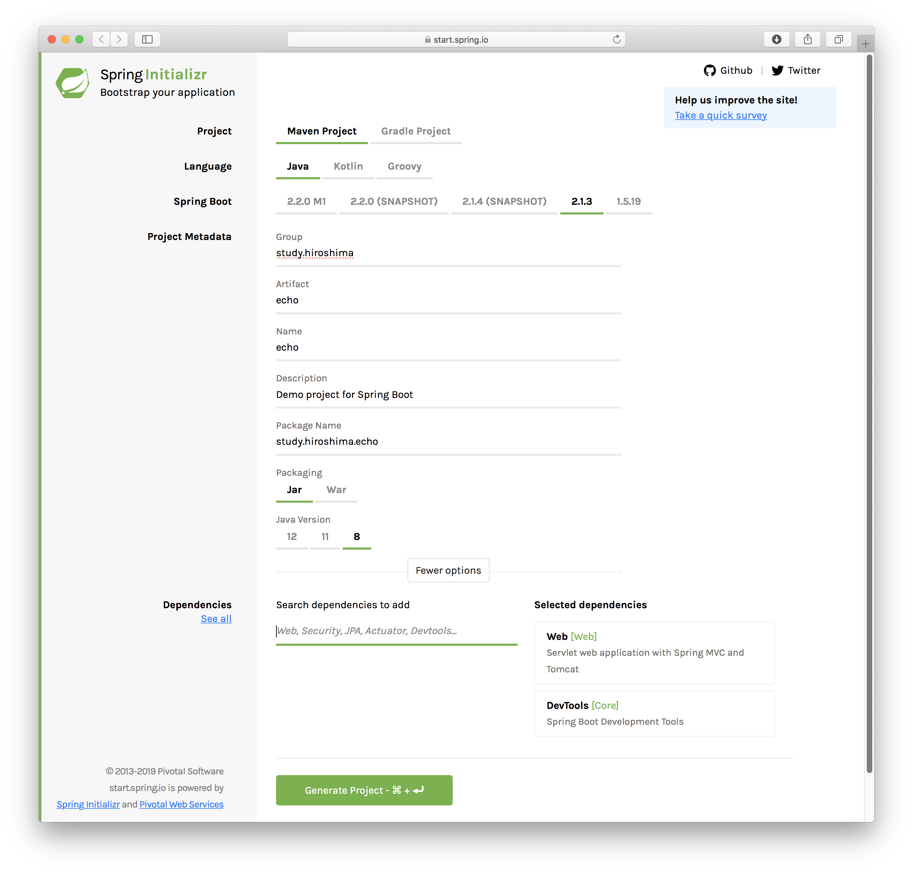

# SpringBoot でマイクロサービスコンテナを作成する

## 背景
- 使い慣れた、エンジニアもいっぱいいるJavaを使いたい
- Spark とかも素敵なのだが、従来型アーキテクチャとのコードの融通もふくめ SpringBoot でいってみる
- マイクロサービスがきちんと設計されていれば、途中でアーキテクチャを変えたくなっても全部書き直しという事態は避けられるので安心

## 方針
- あるドメインに関して、モデル層、ビジネスロジック層を包括するマイクロサービスを作成する
- モデル層のデータの永続化をKubernetes環境で受け持つとストレージがからんできて、話が複雑になってしまうため、そこはマネージドサービス(RDB, NoSQL, BLOB, ...)に任せ(or 従来どおりIaaSの仮想サーバーで構築し)、マイクロサービスコンテナにはキャッシュ以外の状態を持たない

- SpringBoot + Swagger (+ 任意のストレージ) でマイクロサービスの雛形を作成する

## 懸念点
- SpringBoot はマイクロサービスには大きすぎない？ → マイクロサービス呼び出しのオーバーヘッドを考えるとそこまでマイクロにしてはならない（ === どうせ大きくなる )
- 外部サービス前提にすると、フライト中とかコーディングできないね。( === 互換コンテナを作成してネットワークから切れた状態でもテスト可能にしておく )

## 出来上がったもの
https://github.com/nebosuke/springboot-echo-server POSTしたメッセージを単に返してくれるサービス

## 生成した手順

1. SpringInitializer を利用してアプリの雛形を作成する
- https://start.spring.io を使うか、Eclipse + STS で初期プロジェクトを作成


1. RESTサービス用にSwaggerなどを依存関係に追加
```diff
diff --git a/pom.xml b/pom.xml
index 17fc7c0..6a45563 100644
--- a/pom.xml
+++ b/pom.xml
@@ -15,7 +15,10 @@
 	<description>Demo project for Spring Boot</description>
 
 	<properties>
+		<project.build.sourceEncoding>UTF-8</project.build.sourceEncoding>
+		<project.reporting.outputEncoding>UTF-8</project.reporting.outputEncoding>
 		<java.version>1.8</java.version>
+		<failOnMissingWebXml>false</failOnMissingWebXml>
 	</properties>
 
 	<dependencies>
@@ -34,6 +37,34 @@
 			<artifactId>spring-boot-starter-test</artifactId>
 			<scope>test</scope>
 		</dependency>
+		<dependency>
+			<groupId>javax.xml.bind</groupId>
+			<artifactId>jaxb-api</artifactId>
+		</dependency>
+		<dependency>
+			<groupId>io.swagger</groupId>
+			<artifactId>swagger-annotations</artifactId>
+			<version>1.5.21</version>
+		</dependency>
+		<dependency>
+			<groupId>io.springfox</groupId>
+			<artifactId>springfox-swagger2</artifactId>
+			<version>2.9.2</version>
+		</dependency>
+		<dependency>
+			<groupId>io.springfox</groupId>
+			<artifactId>springfox-swagger-ui</artifactId>
+			<version>2.9.2</version>
+		</dependency>
+		<dependency>
+			<groupId>org.springframework.boot</groupId>
+			<artifactId>spring-boot-configuration-processor</artifactId>
+			<optional>true</optional>
+		</dependency>
+		<dependency>
+			<groupId>com.fasterxml.jackson.core</groupId>
+			<artifactId>jackson-databind</artifactId>
+		</dependency>
 	</dependencies>
 
 	<build>
@@ -42,6 +73,15 @@
 				<groupId>org.springframework.boot</groupId>
 				<artifactId>spring-boot-maven-plugin</artifactId>
 			</plugin>
+			<plugin>
+				<artifactId>maven-compiler-plugin</artifactId>
+				<configuration>
+					<source>${java.version}</source>
+					<target>${java.version}</target>
+					<debug>true</debug>
+					<debuglevel>lines,vars,source</debuglevel>
+				</configuration>
+			</plugin>
 		</plugins>
 	</build>
```

1. Swaggerの設定クラスを追加
- https://github.com/nebosuke/springboot-echo-server/blob/master/src/main/java/study/hiroshima/SwaggerConfig.java

1. REST API のエンドポイントを作成する (この例では全然RESTではないですけど)
- https://github.com/nebosuke/springboot-echo-server/blob/master/src/main/java/study/hiroshima/echo/EchoController.java

1. SpringBootアプリケーションのデフォルト設定を application.yml にセット
```yaml
server:
  port: 8080
#  port: 443
#  ssl:
#    enabled: true
#    protocol: TLSv1.2
#    key-store: echo-service.p12
#    key-store-password: password
#    key-store-type: PKCS12
#    key-alias: echo-service
spring:
  main:
    banner-mode: "off"
  servlet:
    multipart:
      enabled: true
      max-file-size: 1024MB
      max-request-size: 1024MB
```

1. ビルド
```
$ ./mvnw install
```
